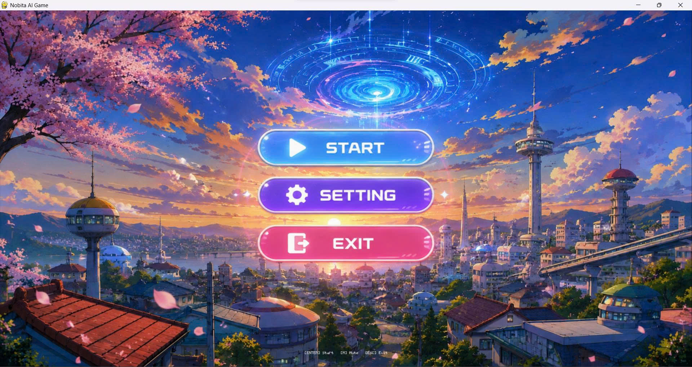
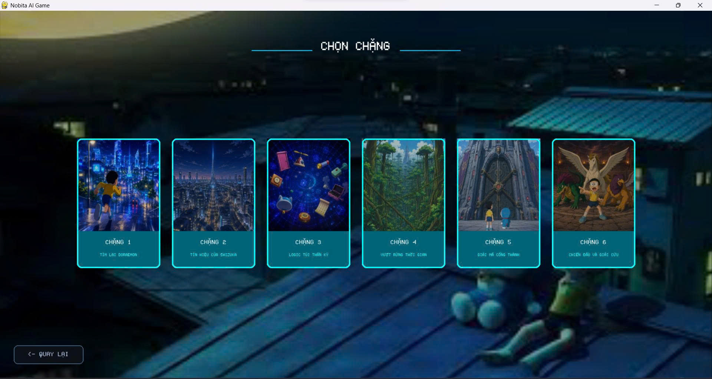
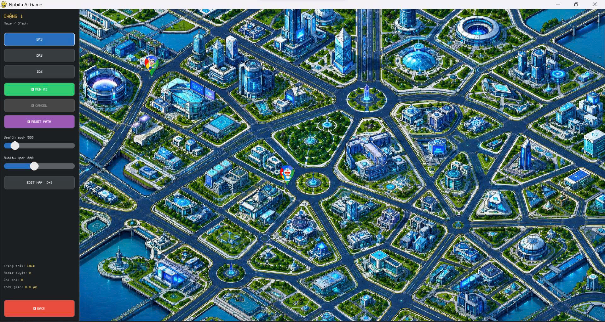
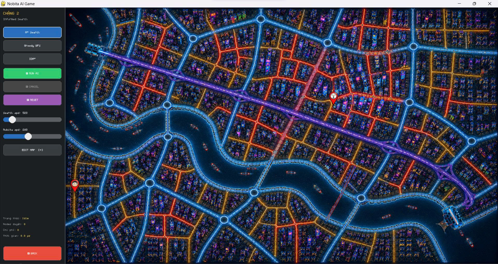
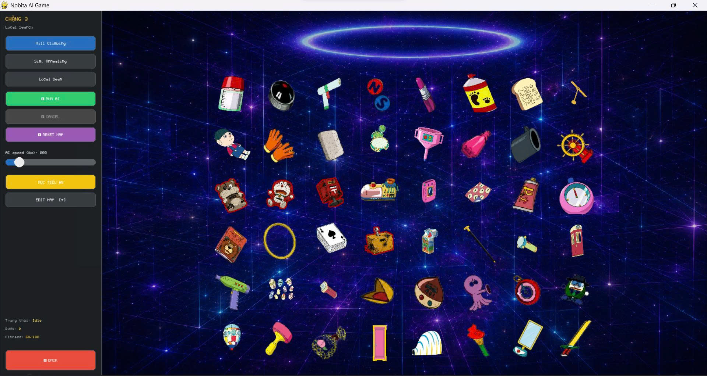
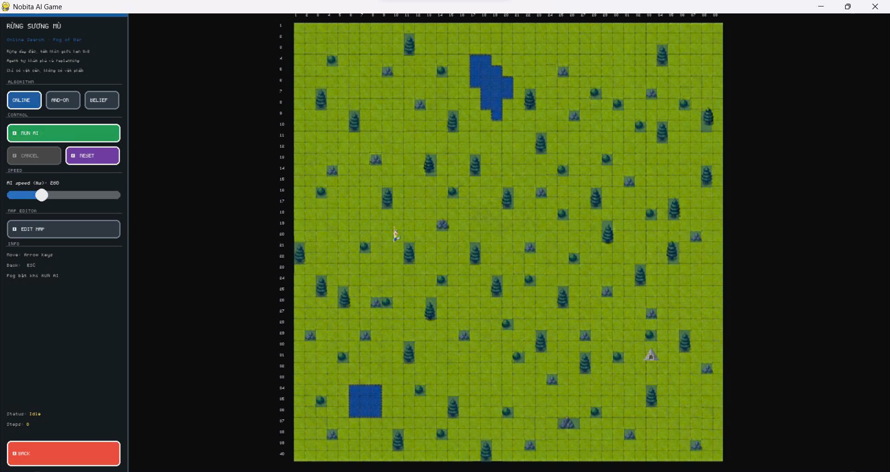
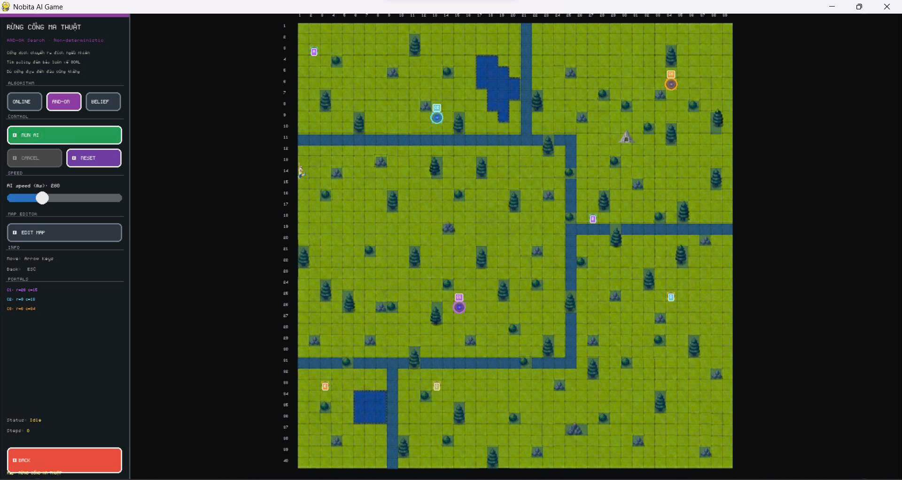
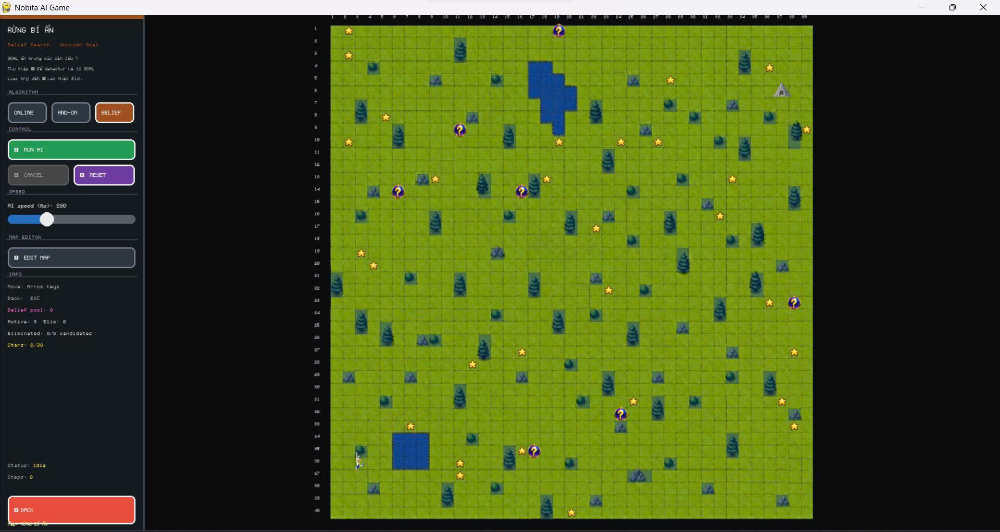
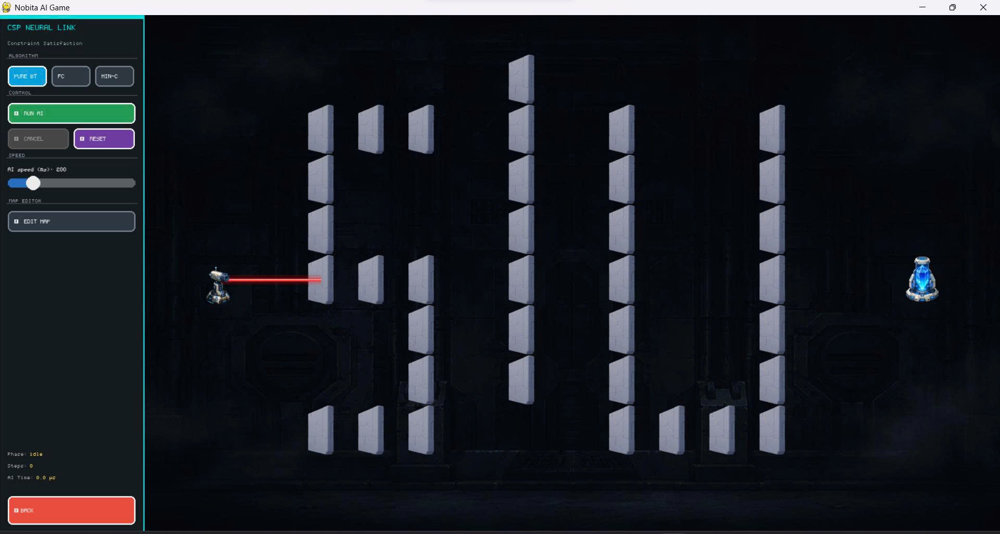
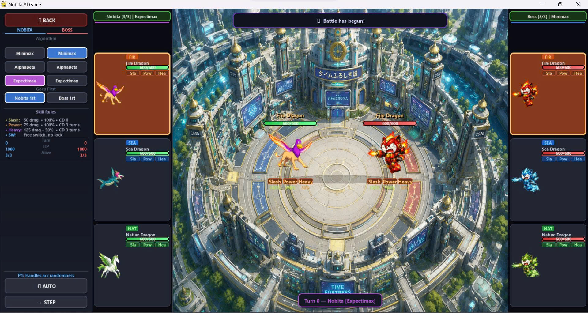

# 🤖 NOBITA: THE LAST HOPE FOR SHIZUKA — HY VỌNG CUỐI CÙNG

> Dự án cuối kỳ môn **Trí Tuệ Nhân Tạo** — Mô phỏng 6 nhóm thuật toán AI thông qua hành trình 6 chặng giải cứu Shizuka của Nobita.

---

## 📖 Mô tả dự án

**NOBITA: THE LAST HOPE FOR SHIZUKA** là một game mô phỏng trực quan được xây dựng bằng **Pygame**, cho phép quan sát cách các thuật toán Trí Tuệ Nhân Tạo hoạt động trong thực tế.

Shizuka bị robot không gian bắt cóc và đưa vào pháo đài thời gian bí ẩn. Nobita — với sự giúp đỡ của Doraemon và những bảo bối thần kỳ — phải vượt qua **6 chặng đường** nguy hiểm. Mỗi chặng là một bài toán AI khác nhau, đòi hỏi người chơi lựa chọn thuật toán phù hợp để giải quyết.

Dự án không chỉ là một game giải trí mà còn là công cụ học tập trực quan, giúp hiểu rõ cơ chế hoạt động của **18 thuật toán AI** thuộc **6 nhóm** từ cơ bản đến nâng cao.

---

## ✨ Tính năng chính

- 🧠 **18 thuật toán AI** được triển khai và mô phỏng trực quan theo từng chặng
- 🗺️ **Setup map linh hoạt** — tùy chỉnh bản đồ và môi trường cho từng chặng
- ▶️ **Trực quan hóa thuật toán** — quan sát từng bước thuật toán hoạt động theo thời gian thực trên Pygame
- 📊 **So sánh hiệu suất** — đánh giá các thuật toán trong cùng nhóm (số bước, thời gian, bộ nhớ)
- 🎮 **6 chặng game** với 6 dạng bài toán AI khác nhau
- 🏆 **Cốt truyện xuyên suốt** — giải cứu Shizuka khỏi robot không gian

---

## 🎬 Demo

| Menu chính | Chọn chặng |
|:----------:|:----------:|
|  |  |

| Chặng 1 | Chặng 2 | Chặng 3 |
|:-------:|:-------:|:-------:|
|  |  |  |

| Chặng 4 - Online Search | Chặng 4 - AND-OR Search | Chặng 4 - Belief Search |
|:-----------------------:|:-----------------------:|:-----------------------:|
|  |  |  |

| Chặng 5 | Chặng 6 |
|:-------:|:-------:|
|  |  |

---

## 🗺️ Tổng quan 6 chặng & 18 thuật toán

| Chặng | Tên | Nhóm thuật toán | Thuật toán áp dụng | Mục tiêu cụ thể |
|:-----:|-----|-----------------|-------------------|-----------------|
| **1** | Tìm lại Doraemon | Uninformed Search | BFS · DFS · IDS | Nobita tìm đường đến Doraemon trong đồ thị có trọng số |
| **2** | Tín hiệu của Shizuka | Informed Search | A\* · Greedy · IDA\* | Tìm đường ngắn nhất qua đồ thị trọng số dùng heuristic khoảng cách |
| **3** | Logic túi thần kỳ | Local Search | Hill Climbing · Simulated Annealing · Local Beam | Di chuyển bảo bối đến vị trí tối ưu để thu thập, tối đa hóa fitness |
| **4** | Vượt rừng thời gian | Complex Environments | Online Search · AND-OR Search · Belief Search | Vượt rừng sương mù, cổng không đơn định và tìm đích ẩn trong các lều |
| **5** | Giải mã cổng thành | Constraint Satisfaction | Backtracking · Forward Checking · Min-Conflicts | Đặt gương để tia laser từ súng đến đích, thỏa mọi ràng buộc phản chiếu |
| **6** | Chiến đấu và giải cứu | Adversarial Search | Minimax · Alpha-Beta · Expectimax | AI tự chọn chiêu và đổi rồng tối ưu trong trận đấu đối kháng theo lượt |

> 🏆 **Mục tiêu cuối cùng:** Giải cứu Shizuka!

---

## 🔍 Chi tiết từng chặng

---

### ⚡ Chặng 1 — Tìm lại Doraemon | Uninformed Search

**Bối cảnh:** Shizuka bị robot không gian bắt cóc — Nobita lập tức lên đường tìm Doraemon để nhờ sự giúp đỡ và sử dụng bảo bối thần kỳ.

**Môi trường:** Bản đồ dạng đồ thị với các ô trống và vật cản.

**Trạng thái:** Vị trí hiện tại của Nobita trên bản đồ.

**Mục tiêu:** Tìm đường đi từ vị trí xuất phát đến vị trí Doraemon.

| Thuật toán | Mô tả | Đặc điểm |
|------------|-------|-----------|
| **BFS** (Breadth-First Search) | Duyệt theo chiều rộng, mở rộng tất cả node cùng mức trước | Tìm đường ngắn nhất (theo số bước), tốn bộ nhớ |
| **DFS** (Depth-First Search) | Duyệt theo chiều sâu, đi sâu nhất có thể trước khi quay lui | Tiết kiệm bộ nhớ, không đảm bảo đường ngắn nhất |
| **IDS** (Iterative Deepening Search) | Kết hợp DFS lặp với giới hạn độ sâu tăng dần | Tối ưu như BFS, tiết kiệm bộ nhớ như DFS |

---

### 🧭 Chặng 2 — Tín hiệu của Shizuka | Informed Search

**Bối cảnh:** Sau khi tìm được Doraemon, cả hai nhận được tín hiệu từ Shizuka nhưng tín hiệu quá yếu. Nobita phải đến trạm tín hiệu gần nhất để khuếch đại và xác định chính xác vị trí của Shizuka.
**Môi trường:** Đồ thị có trọng số — các nút là địa điểm, cạnh là đường đi với chi phí (khoảng cách).

**Hàm heuristic:** Khoảng cách Euclidean từ node hiện tại đến đích.

**Trạng thái:** Vị trí hiện tại của Nobita và chi phí tích lũy.

| Thuật toán | Hàm đánh giá | Đặc điểm |
|------------|--------------|-----------|
| **A\*** | f(n) = g(n) + h(n) — g(n): chi phí thực (Euclidean × trọng số), h(n): Euclidean đến đích | Tối ưu và đầy đủ nếu heuristic chấp nhận được |
| **Greedy** | f(n) = h(n) — chỉ dùng Euclidean đến đích | Nhanh nhưng không đảm bảo tối ưu |
| **IDA\*** | Giống A\* nhưng dùng DFS với ngưỡng f(n) tăng dần | Tiết kiệm bộ nhớ hơn A\*, vẫn tối ưu |

---

### 📦 Chặng 3 — Logic túi thần kỳ | Local Search

**Bối cảnh:** Đã có tín hiệu cụ thể, Nobita và Doraemon khẩn trương chuẩn bị các bảo bối cần thiết từ túi thần kỳ để sẵn sàng ứng phó với mọi tình huống trong hành trình giải cứu phía trước.

**Môi trường:** Lưới **8 cột × 6 hàng**. Bảo bối xuất phát ở hàng 6 (dưới cùng), cần đưa lên hàng 1 (trên cùng).

**Trạng thái:** Cấu hình hiện tại của các ô trên lưới.

**Hàm mục tiêu (fitness):** Số bảo bối đã lên hàng trên cùng (càng gần càng tốt).

| Thuật toán | Cơ chế | Đặc điểm |
|------------|--------|-----------|
| **Hill Climbing** | Leo đồi đơn giản — luôn chọn trạng thái lân cận tốt hơn | Nhanh, dễ bị kẹt ở cực trị cục bộ |
| **Simulated Annealing** | Cho phép chấp nhận trạng thái tệ hơn với xác suất giảm dần theo "nhiệt độ" | Thoát cực trị cục bộ, tìm nghiệm tốt hơn |
| **Local Beam (k=3)** | Duy trì k=3 trạng thái song song, chọn k trạng thái tốt nhất từ tất cả lân cận | Khám phá rộng hơn, ít bị mắc kẹt hơn Hill Climbing |

---

### 🌲 Chặng 4 — Vượt rừng thời gian | Complex Environments

**Bối cảnh:** Tín hiệu dẫn đến một khu rừng rậm rạp và nguy hiểm — nơi pháo đài thời gian của robot không gian đang ẩn giấu bên trong. Nobita phải tìm đường vượt qua khu rừng phức tạp này.

#### 🔦 Map 1 — Online Search (Môi trường quan sát cục bộ)

**Đặc điểm map:** Nobita chỉ nhìn thấy **8 ô xung quanh** và biết vị trí đích (goal). Phần còn lại của bản đồ bị che khuất.

**Cơ chế:** Agent khám phá môi trường theo thời gian thực, cập nhật nhận thức về bản đồ sau mỗi bước di chuyển.

#### 🌀 Map 2 — AND-OR Search (Môi trường không xác định)

**Đặc điểm map:** Bản đồ chia khu vực với **2 loại cổng dịch chuyển:**
- **Cổng dịch chuyển thường:** Được chọn vị trí dịch chuyển — chọn là đến.
- **Cổng ngẫu nhiên:** Không được chọn vị trí dịch chuyển. Xác suất 50% dẫn đến 1 vị trí, 50% đưa đến vị trí khác.

**Cơ chế:** Xây dựng cây AND-OR, lập kế hoạch dự phòng cho cả hai nhánh kết quả của cổng ngẫu nhiên.

#### 🌫️ Map 3 — Belief Search (Tìm kiếm niềm tin)

**Đặc điểm map:** Nobita không biết chính xác đâu là goal thật sự trong một **tập hợp các goal ứng viên** rải trên bản đồ.

**Cơ chế:**
- Di chuyển lần lượt đến từng goal ứng viên để kiểm tra và loại trừ.
- Trên đường đi, nếu chạm vào **ngôi sao ★** rải rác trên map → được **quét ngẫu nhiên 1 trạng thái** trong tập goal (tiết lộ 1 goal là thật hay giả).
- Cập nhật tập niềm tin (belief state) sau mỗi lần loại trừ hoặc quét được thông tin.

---

### 🔬 Chặng 5 — Giải mã cổng thành | Constraint Satisfaction Problems

**Bối cảnh:** Tìm được pháo đài thời gian, nhưng cổng vào bị khóa bằng pha lê ma thuật. Nobita phải điều chỉnh các gương trong pháo đài để tia laser phá vỡ pha lê và mở cổng.

**Môi trường:** Bản đồ lưới hình chữ nhật.
- **Tia laser** bắn từ **ô giữa bên trái** theo hướng ngang sang phải.
- **Pha lê** đặt tại **ô giữa bên phải** — là đích đến của tia laser.
- Tia laser phản chiếu khi gặp gương, bị chặn khi gặp tường/vật cản.

**Biến (Variables):** Mỗi ô trên lưới có 3 trạng thái:
- `0` — Ô trống
- `1` — Gương `\`
- `2` — Gương `/`

**Ràng buộc (Constraints):** Tia laser không chiếu vào vật cản, Tia laser không chiếu ra biên, Tia laser xuất phát từ cạnh trái phải chiếu đến đúng vị trí pha lê ở cạnh phải.

| Thuật toán | Cơ chế | Đặc điểm |
|------------|--------|-----------|
| **Backtracking** | Thử từng giá trị cho từng ô, quay lui khi vi phạm ràng buộc | Đầy đủ, có thể chậm với không gian lớn |
| **Forward Checking** | Sau mỗi lần gán, loại bỏ giá trị không hợp lệ khỏi các biến chưa gán | Phát hiện sớm mâu thuẫn, hiệu quả hơn Backtracking |
| **Min-Conflict** | Bắt đầu từ trạng thái ngẫu nhiên, lặp lại chọn biến vi phạm và gán giá trị ít xung đột nhất | Nhanh cho bài toán lớn, không đảm bảo tìm được nghiệm |

---

### ⚔️ Chặng 6 — Chiến đấu và giải cứu | Adversarial Search

**Bối cảnh:** Xâm nhập thành công vào pháo đài, Nobita đối mặt với đội robot không gian trong trận chiến quyết định. Nobita triệu hồi **3 con rồng** (hệ Lửa 🔥 · Nước 💧 · Lá 🌿) để đấu với **3 robot không gian** cũng sở hữu hệ Lửa · Nước · Lá. Đấu theo lượt, mỗi lượt có thể tấn công hoặc đổi rồng.

**Luật tương khắc:** **Lửa** 🔥 khắc **Lá** 🌿 · **Lá** 🌿 khắc **Nước** 💧 · **Nước** 💧 khắc **Lửa** 🔥 — tấn công vào hệ bị khắc gây **gấp đôi sát thương**. Mỗi rồng có chỉ số máu riêng, trận đấu kết thúc khi một bên hết toàn bộ máu.

**Trạng thái:** Hệ của từng con trên sân, điểm số, lượt đi hiện tại.

| Thuật toán | Cơ chế | Đặc điểm |
|------------|--------|-----------|
| **Minimax** | Nobita (MAX) chọn nước đi tối đa hóa điểm, Robot (MIN) chọn nước đi tối thiểu hóa điểm của Nobita | Tối ưu nhưng duyệt toàn bộ cây |
| **Alpha-Beta Pruning** | Minimax + cắt tỉa nhánh không ảnh hưởng đến kết quả (α ≥ β) | Nhanh hơn Minimax đáng kể, cùng kết quả |
| **Expectimax** | Nút MAX cho Nobita, nút CHANCE (kỳ vọng xác suất đều) thay vì nút MIN cho Robot | Phù hợp khi đối thủ hành động ngẫu nhiên, không tối ưu |

---

## ⚙️ Hướng dẫn cài đặt

### Yêu cầu môi trường

| Thành phần | Phiên bản |
|------------|-----------|
| Python | 3.12.0 |
| Pygame | 2.6.1 |
| SDL | 2.28.4 (đi kèm Pygame) |

### Các bước cài đặt

**Bước 1:** Tải dự án về máy

```bash
git clone https://github.com/quangtruong2006/GAME-AI
cd GAME-AI
```

Hoặc tải file ZIP → giải nén → mở terminal trong thư mục dự án.


**Bước 2:** Cài đặt Python 3.12.0
```bash
Tải Python 3.12.0 tại: https://www.python.org/downloads/release/python-3120/
```
Trong quá trình cài, nhớ tick vào "Add Python to PATH" trước khi nhấn Install.


**Bước 3:** Cài đặt thư viện

```bash
pip install pygame==2.6.1
```

**Bước 4:** Chạy game

```bash
python main.py
```

---

## 📁 Bố cục code

```
GAME-AI
│
├── main.py                 # Entry point
├── config.py               # Game configuration
├── requirements.txt        # Dependencies
│
├── algorithms
│   ├── uninformed
│   │   ├── bfs.py
│   │   ├── dfs.py
│   │   └── ids.py
│   │
│   ├── informed
│   │   ├── a_star.py
│   │   ├── greedy.py
│   │   └── ida_star.py
│   │
│   ├── local
│   │   ├── hill_climbing.py
│   │   ├── simulated_annealing.py
│   │   └── local_beam_search.py
│   │
│   ├── complex_environments
│   │   ├── and_or_search.py
│   │   ├── belief_search.py
│   │   └── online_search.py
│   │
│   ├── csp
│   │   ├── pure_backtracking.py
│   │   ├── forward_checking.py
│   │   └── min_conflicts.py
│   │
│   └── adversarial
│       ├── minimax.py
│       ├── alphabeta.py
│       └── expectimax.py
│
├── stages
│   ├── menu.py
│   ├── stage_select.py
│   ├── stage1_maze.py
│   ├── stage2_city.py
│   ├── stage3_inventory.py
│   ├── stage4_forest.py
│   ├── stage5_seal.py
│   └── stage6_boss.py
│
├── modules
│   ├── ai_module.py
│   ├── map_module.py
│   ├── gui_module.py
│   └── stats_module.py
│
├── ui
│   └── victory_panel.py
│
└── assets
    ├── images
    ├── maps
    ├── sounds
    └── fonts
```


---

## 🕹️ Cách sử dụng

### Luồng chơi cơ bản

```
Khởi chạy → Chọn chặng → Chọn thuật toán → Setup map → Chạy & quan sát → Xem kết quả
```

### Hướng dẫn chi tiết

**1. Khởi chạy game**
```bash
python main.py
```

**2. Chọn chặng** từ màn hình menu chính (Chặng 1 → 6)

**3. Chọn thuật toán** trong danh sách của chặng đó

**4. Setup map** *(với các chặng hỗ trợ)*
- Chặng 1, 2: Vẽ/chọn bản đồ, đặt vị trí xuất phát và đích
- Chặng 3: Bố trí bảo bối trên lưới 8×6
- Chặng 4: Chọn 1 trong 3 map (Online / AND-OR / Belief)
- Chặng 5: Thiết lập lưới gương, laser và pha lê
- Chặng 6: Chọn thuật toán mà robot không gian sử dụng

**5. Nhấn Run** để quan sát thuật toán hoạt động từng bước

**6. Xem kết quả so sánh** — số bước đi, thời gian thực thi

**7. Hoàn thành 6 chặng** để giải cứu Shizuka! 🎉

---

## 🛠️ Công nghệ sử dụng

| Công nghệ | Phiên bản | Mục đích |
|-----------|-----------|----------|
| **Python** | 3.12.0 | Ngôn ngữ lập trình chính |
| **Pygame** | 2.6.1 | Xây dựng giao diện game và trực quan hóa |
| **SDL** | 2.28.4 | Nền tảng đồ họa/âm thanh của Pygame |

---

## 🚧 Hạn chế & Hướng phát triển

### Hạn chế hiện tại

- Kích thước bản đồ cố định ở một số chặng
- Chưa có chế độ người chơi tự điều khiển Nobita
- Chưa lưu lịch sử kết quả các lần chạy

### Hướng phát triển

- Thêm chế độ **tự tạo map** cho người dùng
- Thêm **biểu đồ so sánh** hiệu suất các thuật toán sau mỗi chặng
- Mở rộng thêm thuật toán mới cho từng nhóm
- Thêm **bảng xếp hạng** thời gian hoàn thành

---

## 👥 Tác giả

Dự án được thực hiện bởi nhóm sinh viên trường **Đại học Sư phạm Kỹ thuật TP.HCM (HCMUTE)**.

**Nhóm 16**
| Họ và tên | MSSV | Vai trò |
|-----------|------|---------|
| *Nguyễn Quang Trường* | *24110367* | *Chặng 2, 3, 5 - Informed Search & Local Search & Constraint Satisfaction Problems* |
| *Nguyễn Thanh Vân* | *24110379* | *Chặng 1, 6 - Uninformed Search & Adversarial Search* |
| *Trần Thu Uyên* | *24110378* | *Chặng 4 — Complex Environments · Giao diện tổng dự án & Menu chính · Hiển thị thông số kết quả · Thu thập & thiết kế assets (nhân vật, bản đồ, icon UI)* |

> 📧 Liên hệ: *thanhvandz102@gmail.com*
>
> 🏫 Môn học: Trí Tuệ Nhân Tạo — Đợt *2*, Học kỳ *2*, năm học *2026-2027*

---

<p align="center">
  Made with ❤️ for AI Course Final Project — HCMUTE
</p>
